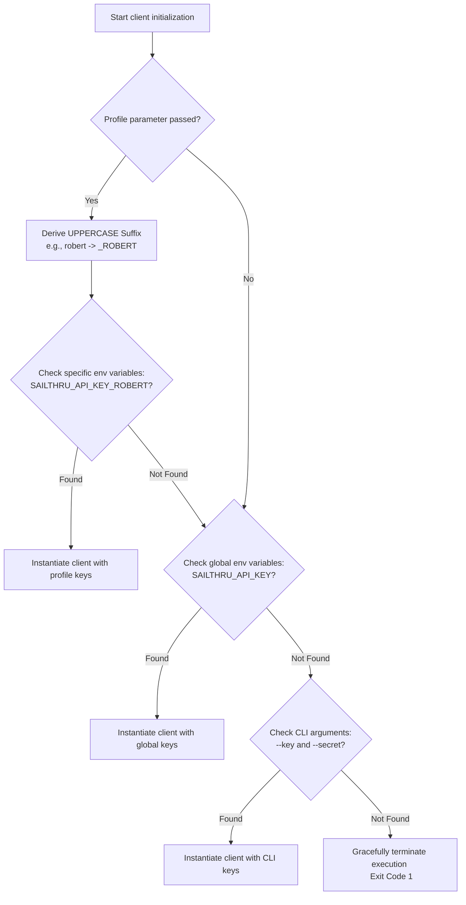

# Enterprise Solutions Engineering Automation Hub

A consolidated, enterprise-grade engineering hub designed to automate high-volume user data ingestion, transactional messaging validation, support auditing, and client delivery operations. This framework consolidates legacy, fragmented script engines into an object-oriented codebase built around a strict **Zero-Leak Security Boundary** and high-throughput reliability.

[👉 View Master Repository on GitHub](https://github.com/Rhegedus/sailthru-solutions-automation)

---

## System Architecture Overview

In enterprise Solutions Engineering contexts, automation scripts often operate in isolated silos, causing maintenance overhead, inconsistent security baselines, and code duplication. This toolkit resolves these issues by consolidating utility scripts into five distinct, standardized functional layers. 

Every component has been audited and sanitized to decouple internal credentials, eliminate corporate PII leaks, and enforce standard exception handling boundaries.

```
├── Core/                        # Centralized routing & bootstrap layers
├── Ingestion-Engines/           # High-volume content & profile ingestion
├── Messaging-Orchestration/     # Delivery validation & third-party integrations
├── Client-Workflows/            # Customized, client-specific execution paths
└── SDK-Integrations/            # Target client wrappers (PHP, Ruby)
```

---

## Scannable Modular Breakdown

Below is a breakdown of the consolidated modular folders, detailing their architectural responsibilities and containing links to specific execution scripts within the master repository:

### 1. Core Runtime Services
*   [`Core/require.php`](https://github.com/Rhegedus/sailthru-solutions-automation/blob/master/Core/require.php): The central environment-variable profile router and argument parser. It serves as the framework bootstrap wrapper, dynamically instantiating API clients based on system environments and exposing utility converters (e.g., base64-to-hex converter pipelines for MongoDB Object IDs).

### 2. Ingestion Engines
*   [`Ingestion-Engines/CSV-to-API.php`](https://github.com/Rhegedus/sailthru-solutions-automation/blob/master/Ingestion-Engines/CSV-to-API.php): High-volume sequential streaming data ingest module. It reads user variables from flat CSV files and streams them line-by-line into the platform's profile API, preserving low-memory footprints during migrations.
*   [`Ingestion-Engines/Spider_from_file.php`](https://github.com/Rhegedus/sailthru-solutions-automation/blob/master/Ingestion-Engines/Spider_from_file.php): Automated programmatic asset crawler. This script processes URLs from plain-text files, sanitizes trailing parameters, and triggers the Sailthru Content Crawler to index assets or update metadata dynamically.

### 3. Messaging Orchestration
*   [`Messaging-Orchestration/Send.php`](https://github.com/Rhegedus/sailthru-solutions-automation/blob/master/Messaging-Orchestration/Send.php): Batched transactional delivery validation engine. Supporting customizable schedule times, headers (CC, BCC, Reply-To), and limits, it serves as a load-testing and template validation client.
*   [`Messaging-Orchestration/zendesk/`](https://github.com/Rhegedus/sailthru-solutions-automation/tree/master/Messaging-Orchestration/zendesk): Isolated ticket administration tools mapping to the Zendesk REST API framework. Features centralized ticket fetching, agent activity auditing, and organization checks.

### 4. Client-Specific Workflows
*   [`Client-Workflows/wowcher/manual_campaign.php`](https://github.com/Rhegedus/sailthru-solutions-automation/blob/master/Client-Workflows/wowcher/manual_campaign.php): Location-routed campaign scheduler utilizing dynamic time-offset throttling. To prevent API limit saturation when scheduling simultaneous regional campaigns, the script adds incremental delivery delays dynamically.

### 5. SDK Integrations
*   `SDK-Integrations/`: Houses native PHP and Ruby client wrappers (submodules) allowing the automation scripts to execute high-level methods with robust connection-handling logic.

---

## Architectural Deep Dives

### 1. Zero-Leak Profile Routing Logic (`Core/require.php`)

Hardcoded API credentials represent a severe security risk, especially in public-facing or collaborative codebases. The framework enforces a **Zero-Leak Security Boundary** by routing all client instantiations through a dynamic credential loader in `Core/require.php`.

The class uses a context-aware fallback chain to resolve credentials:



This tiered resolution allows engineers to alternate profiles via a single CLI parameter (`--user robert`) while keeping sensitive keys isolated in their local environment variables, ensuring that no keys are ever committed to version control.

### 2. Constant-Memory CSV Streaming (`Ingestion-Engines/CSV-to-API.php`)

When performing enterprise-scale user migrations, datasets can exceed millions of rows. Standard file-reading mechanisms like `file()` load the entire CSV file into memory, leading to $O(N)$ space complexity and inevitable Out-Of-Memory (OOM) failures under strict runtime limitations.

To maintain system stability and resource safety, the CSV ingestion engine utilizes a streaming memory-safety pattern:

```php
// Sequential streaming via an O(1) buffer
$handle = fopen($file, "r");
while (($data = fgetcsv($handle, 1024, ",")) !== FALSE) {
    // Operations constrained to a single active record
}
```

*   **Linear Execution, Constant Memory ($O(1)$ Space):** Instead of buffering all records, the script reads a single line, processes the array mapping, validates columns against headers using `array_combine()`, updates the API, and discards the record before moving to the next line.
*   **Column Invariant Checks:** If a line fails to match the header column count, the engine logs a mismatch warning to `stderr` and skips to the next row, preventing database corruption from misaligned fields.
*   **Sequential Dispatch:** Rate limits are respected, and transient connection breaks are isolated to the single active row rather than failing the entire ingestion batch.

---

## Runtime Blueprint: Secure Credential Loading

The following blueprint illustrates how `Core/require.php` parses command-line arguments and implements the tiered credential lookup hierarchy safely:

```php
<?php

/**
 * Solutions Engineering Toolkit - Secure Bootstrapper Blueprint
 * Demonstrates zero-leak dynamic environment routing.
 */

// 1. Argument Parser Utility
function get_arg($arg, $default = null) {
    if (!isset($GLOBALS['argv'])) {
        return $default;
    }
    $i = array_search($arg, $GLOBALS['argv']);
    if ($i === false) {
        return $default;
    }
    return isset($GLOBALS['argv'][$i + 1]) ? $GLOBALS['argv'][$i + 1] : $default;
}

// 2. Tiered Profile Resolver
function userkey($user = null) {
    // Resolve user parameter from CLI if not passed programmatically
    if ($user === null || $user === '') {
        $user = get_arg('--user') ?: get_arg('--acct');
    }

    $key = null;
    $secret = null;
    $suffix = '';

    if ($user !== null && $user !== '') {
        $user = strtolower(trim($user));
        // Normalize user name for env variable structure
        $suffix = strtoupper(str_replace(['-', ' '], '_', $user));
        
        // Priority 1: Profile-Specific environment overrides
        $key = getenv("SAILTHRU_API_KEY_{$suffix}");
        $secret = getenv("SAILTHRU_API_SECRET_{$suffix}");
    }

    // Priority 2: Universal global fallback
    if (!$key || !$secret) {
        $key = getenv('SAILTHRU_API_KEY');
        $secret = getenv('SAILTHRU_API_SECRET');
    }

    // Priority 3: Ephemeral CLI arguments (debugging/sandbox use)
    if (!$key || !$secret) {
        $key = get_arg('--key');
        $secret = get_arg('--secret');
    }

    // Safe error boundary: Graceful termination rather than silent API failures
    if (!$key || !$secret) {
        fwrite(STDERR, "\n[ERROR] Credentials could not be resolved.\n");
        if (!empty($suffix)) {
            fwrite(STDERR, "Configure variables: SAILTHRU_API_KEY_{$suffix} and SAILTHRU_API_SECRET_{$suffix}\n");
        }
        fwrite(STDERR, "Or configure globals: SAILTHRU_API_KEY and SAILTHRU_API_SECRET\n\n");
        exit(1);
    }

    // Instantiate and return client wrapper
    return new Sailthru_Client($key, $secret);
}
```

This pattern ensures that execution environments remain secure, modular, and portable across developer workstations, automated test systems, and production pipelines.

